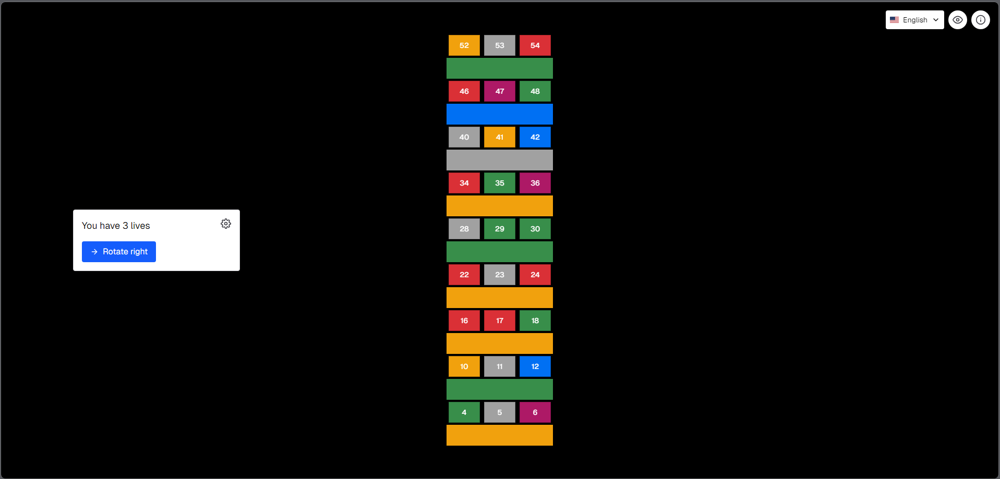
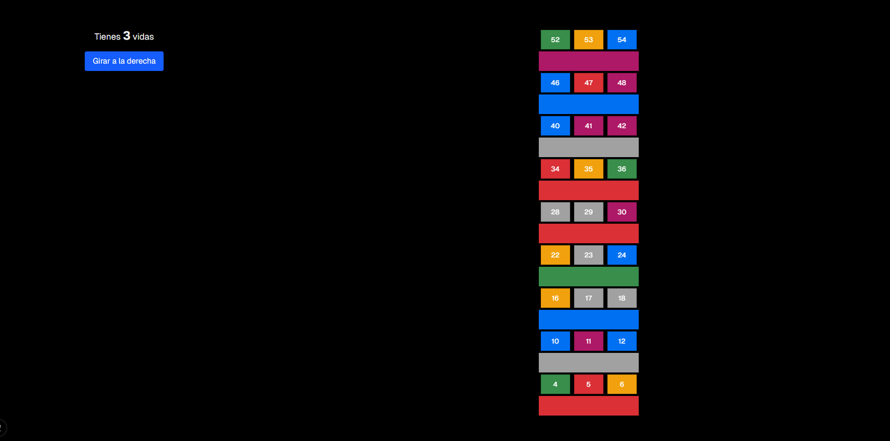
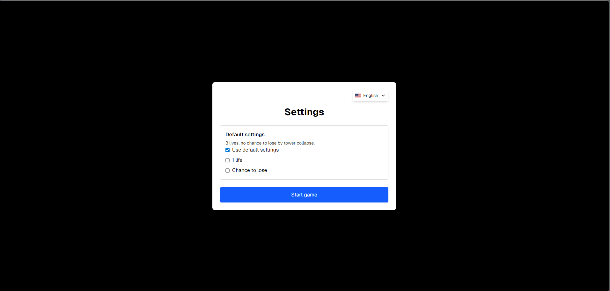
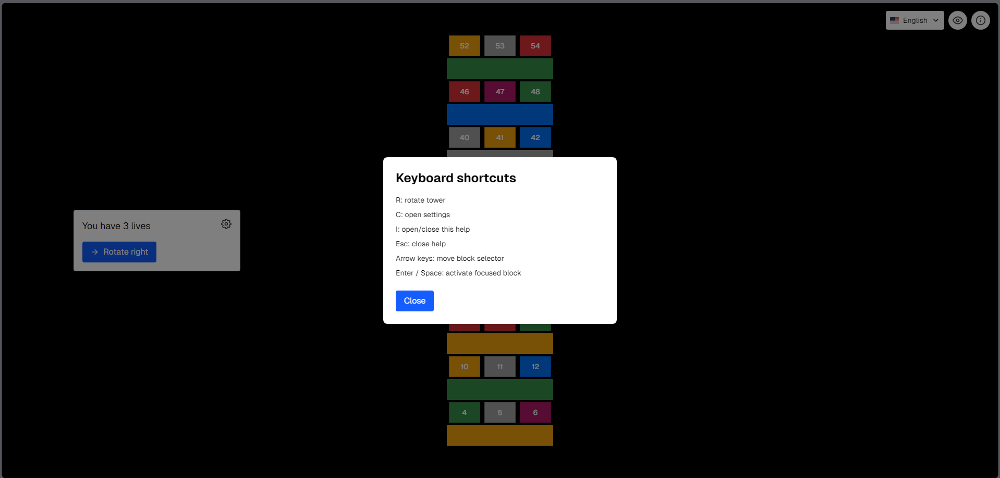
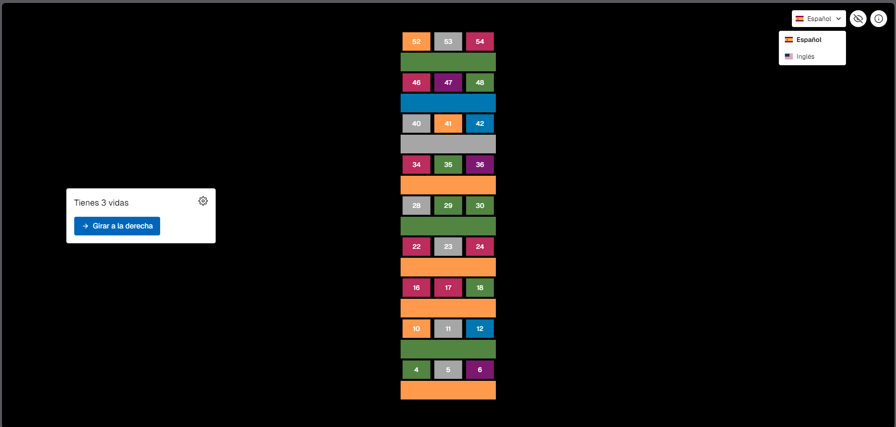
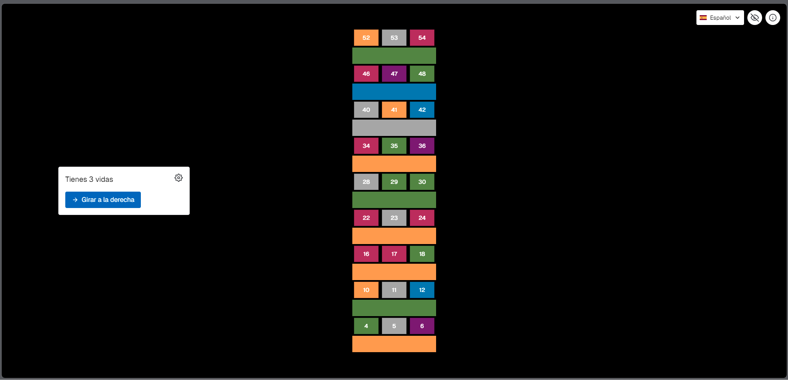

# 🧮 Math Jenga

[](https://nextjs.org/)
[](https://www.typescriptlang.org/)
[](https://reactjs.org/)
[](https://tailwindcss.com/)
[](./LICENSE)

An interactive educational game that combines the classic Jenga tower with mathematical challenges designed for elementary school students. Build mathematical skills while having fun!

## 🎯 Overview

Math Jenga is an engaging web-based learning game that helps children practice arithmetic operations (addition and subtraction) in a playful environment. Players select cubes from the tower, solve math problems, and place them on top while trying to keep the tower stable.

## 🔗 Live Demo

- GitHub Pages: [https://jasongonzalezdeveloper.github.io/math_jenga/config](https://jasongonzalezdeveloper.github.io/math_jenga/config)

## 📸 Screenshots

<div align="center">
  
### Main Game Interface

*The colorful Jenga tower with numbered cubes*

### Math Challenge Modal

*Interactive modal with math problems*

### Configuration Screen

*Game settings with keyboard-accessible options*

### Shortcuts Help Modal

*Keyboard shortcuts overview modal*

### Language Selector (ES/EN)

*Language switcher with flags*

### Colorblind Mode Toggle

*Accessibility toggle for colorblind-friendly visuals*

</div>

> **Note:** Add these screenshot files to `public/screenshots/`:
> - `tower-view.png`
> - `question-modal.png`
> - `config-screen.png`
> - `shortcuts-modal.png`
> - `language-selector.png`
> - `colorblind-mode.png`

## ✨ Features

- 🎲 **Interactive Jenga Tower** - Remove a block, solve the question, and place it on top
- 🧮 **Dynamic Math Questions** - Randomly generated addition/subtraction problems
- 🧱 **Logical Stability Rules** - Collapse is evaluated by row support logic (except the top row)
- 🌪️ **Optional Collapse Chance** - Additional random collapse can be enabled via configuration (`shake`)
- 🚫 **Protected Top Rows** - The top 3 rows cannot be removed directly
- ❤️ **Lives System** - Supports default 3 lives or single-life mode
- 🔄 **Tower Rotation** - Rotate tower orientation during gameplay
- 🌐 **Internationalization (ES/EN)** - Live language switch with flag selector
- ♿ **Accessibility Support** - Keyboard navigation, ARIA labels, focus-visible styles
- 👁️ **Colorblind Mode** - Global visual mode toggle persisted in localStorage
- 📱 **Responsive Layout** - Works on desktop and mobile devices

## 🚀 Getting Started

### Prerequisites

- Node.js 20.x or higher
- npm, yarn, or pnpm

### Installation

1. Clone the repository:
```bash
git clone https://github.com/yourusername/math_jenga.git
cd math_jenga
```

2. Install dependencies:
```bash
npm install
# or
yarn install
# or
pnpm install
```

3. Run the development server:
```bash
npm run dev
# or
yarn dev
# or
pnpm dev
```

4. Open [http://localhost:3000](http://localhost:3000) in your browser to see the game.

## 🎮 How to Play

1. **Select a Block** - Choose a removable block from the visible side
2. **Solve the Math Problem** - The question modal appears for the selected block
3. **Submit Your Answer** - Correct answers unlock placement on the top row
4. **Place on Top** - Select one of the empty top blocks to complete the move
5. **Manage Risk** - Depending on row support and settings, the tower may collapse
6. **Keep Playing** - Continue until lives reach zero

## ⌨️ Keyboard & Accessibility

### In Game

- `R` → Rotate tower
- `C` → Open configuration
- `I` → Open/close shortcuts help modal
- `Esc` → Close shortcuts/help modal (and close question modal)
- `Arrow keys` → Move selected block
- `Enter` / `Space` → Activate selected block

### In Configuration

- `Arrow keys` move between option controls (Default, One Life, Collapse Chance)
- `Enter` starts the game

### Accessibility Notes

- Question modal supports `Esc` to close
- Focus starts on the first configuration option
- Labels/roles are added for interactive controls
- Colorblind mode toggle is available beside the info icon

## 🛠️ Tech Stack

- **Framework:** [Next.js 16](https://nextjs.org/) - React framework with App Router
- **Language:** [TypeScript](https://www.typescriptlang.org/) - Type-safe JavaScript
- **UI Library:** [React 19](https://reactjs.org/) - Component-based UI
- **Styling:** [Tailwind CSS 4](https://tailwindcss.com/) - Utility-first CSS
- **State Management:** [Zustand](https://github.com/pmndrs/zustand) - Lightweight state management
- **Internationalization:** [i18next](https://www.i18next.com/) + [react-i18next](https://react.i18next.com/)
- **Icons:** [react-icons](https://react-icons.github.io/react-icons/)
- **Flags:** [react-country-flag](https://www.npmjs.com/package/react-country-flag)
- **Package Manager:** npm/yarn/pnpm

## 📁 Project Structure

```
math_jenga/
├── app/
│   ├── config/page.tsx             # Configuration screen
│   ├── game/page.tsx               # Game screen (page skeleton)
│   ├── globals.css                 # Global styles + colorblind filter
│   ├── layout.tsx                  # Root layout
│   └── page.tsx                    # Redirect to /config
├── components/
│   ├── common/LanguageSelector.tsx # Reusable ES/EN selector with flags
│   └── game/
│       ├── GameStatusPanel.tsx     # Lives + rotate + settings panel
│       └── ShortcutHelpModal.tsx   # Info modal + top-right controls
├── hooks/
│   ├── useAppTranslation.ts        # i18n hook facade
│   ├── useColorblindMode.ts        # Colorblind mode state/persistence
│   ├── useGameShortcuts.ts         # Global game shortcuts
│   └── useJengaLogic.ts            # Tower/gameplay logic
├── i18n/
│   ├── client.ts                   # i18n client setup
│   └── resources.ts                # ES/EN translation resources
├── lib/
│   ├── Jenga.tsx                   # Tower rendering + keyboard behavior
│   └── QuestionModal.tsx           # Math challenge modal
├── models/
├── public/
├── store/useStore.ts               # Zustand store
└── styles/
```

## 🔮 Roadmap & Future Features

### Upcoming Enhancements

- [ ] **Multiplayer Mode** - Two-player competitive gameplay
- [ ] **Enhanced Animations** - Smooth cube movements and transitions
- [ ] **Difficulty Levels** - Easy, Medium, Hard (with multiplication/division)
- [ ] **Sound Effects** - Audio feedback for actions
- [ ] **Score Tracking** - High scores and progress statistics
- [ ] **Achievement System** - Unlock badges and rewards
- [ ] **Customizable Themes** - Different visual styles
- [ ] **Progressive Math Topics** - Advanced operations for older students

### Long-term Goals

- Mobile app version (React Native)
- Teacher dashboard for classroom use
- Printable worksheets generation
- Integration with educational standards (Common Core, etc.)

## 🌐 Deployment

### GitHub Pages

This project can be deployed to GitHub Pages:

Live URL:

- [https://jasongonzalezdeveloper.github.io/math_jenga/config](https://jasongonzalezdeveloper.github.io/math_jenga/config)

```bash
npm run build
npm run export
```

The static site will be generated in the `out` directory.

## 🤝 Contributing

Contributions are welcome! If you'd like to improve Math Jenga:

1. Fork the repository
2. Create your feature branch (`git checkout -b feature/AmazingFeature`)
3. Commit your changes (`git commit -m 'Add some AmazingFeature'`)
4. Push to the branch (`git push origin feature/AmazingFeature`)
5. Open a Pull Request

## 📄 License

This project is licensed under the MIT License - see the [LICENSE](LICENSE) file for details.

## 🙏 Acknowledgments

- Inspired by the classic Jenga game
- Built with modern web technologies for optimal performance
- Designed with elementary education best practices in mind

## 📊 Project Status

**Status:** Active Development 🟢

This project is actively maintained and new features are being added regularly.

---

<div align="center">
  <strong>Made with ❤️ for young mathematicians</strong>
  <br />
  <sub>Help kids learn math while having fun!</sub>
</div>
